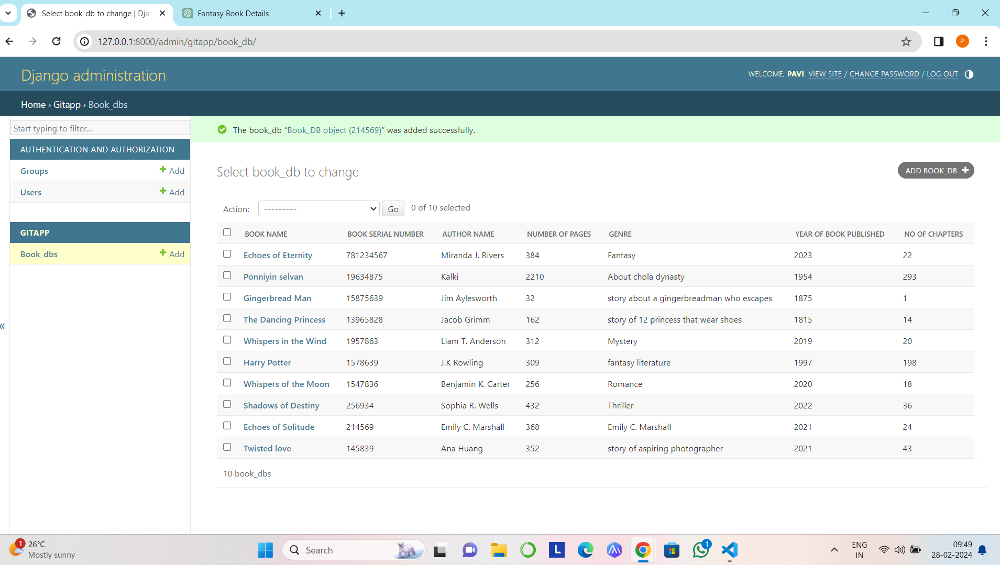

# Ex02 Django ORM Web Application
## Date: 28/02/2024

## AIM
To develop a Django application to store and retrieve data from a Book database using Object Relational Mapping(ORM).

## Entity Relationship Diagram


## DESIGN STEPS

### STEP 1:
Clone the problem from GitHub

### STEP 2:
Create a new app in Django project

### STEP 3:
Enter the code for admin.py and models.py

### STEP 4:
Execute Django admin and create details for 10 books

## PROGRAM
```
models.py

from django.db import models
from django.contrib import admin
class Book_DB(models.Model):
   Book_name=models.CharField(max_length=25);
   Book_serial_number=models.IntegerField(primary_key=True);
   Author_name=models.CharField(max_length=50);
   Number_of_pages=models.IntegerField();
   Genre=models.CharField(max_length=40);
   Year_of_book_published=models.IntegerField();
   No_of_chapters=models.IntegerField();
class Book_DBAdmin(admin.ModelAdmin):
   list_display=("Book_name","Book_serial_number","Author_name","Number_of_pages","Genre","Year_of_book_published","No_of_chapters");


admin.py

from django.contrib import admin
from .models import Book_DB,Book_DBAdmin
admin.site.register(Book_DB,Book_DBAdmin)
```

## OUTPUT




## RESULT
Thus the program for creating a database using ORM hass been executed successfully
